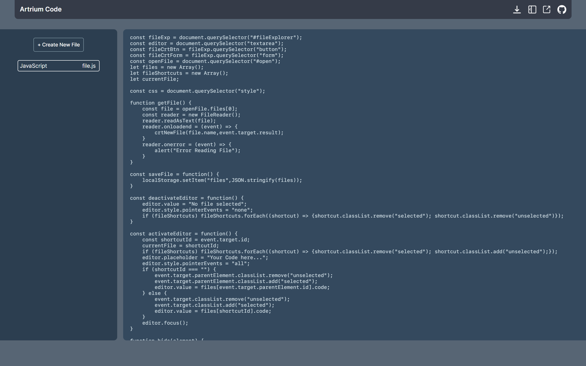

# Artrium Code
### Interactive Editor for Web, for [Samsung SW Contest](https://www.juniorsoftwarecup.com/Contest/About).

## Acknowledgements
As you download the file you've edited, your browser may say that 'This kind of file can harm your computer' or else. It is safe to download, your browser is just warning you because it's the file from the Internet. The content of it is just a code you've edited. In addition, you can delete your files by right-clicking on them.

## Necessary Features
- [ ] Brackets/Quotes Autocomplete
- [X] File Manager (explorer)
- [ ] Miniplayer for Education Platform (e.g. Inflearn, Coursera)
- [ ] Debugging via SSH or API
- [ ] Customizable CSS (theme)
- [ ] Software/Web-app both available

## Necessary Tech/Knowledge
- Python ([Tkinter](https://docs.python.org/3/library/tkinter.html)/[PyQt5](https://pypi.org/project/PyQt5))
- JavaScript ([Electron](https://www.electronjs.org)/[NodeJS](https://nodejs.org))
- C/C++ ([GTK+ 2.0](https://developer.gnome.org/gtk-tutorial/stable/))

## Known Bugs & Issues
* Bracket/Quote Autocomplete
  * Multiple bracket support not working (except quotes)
  * Automatically tabbed after one character is typed in 2~{n}th line in bracket
  
## Copyrights
- [Toggle Icon](https://icon-icons.com/icon/sidebar-expand-toggle-nav/145935)
- [Download Icon](https://www.iconfinder.com/icons/5204156/download_icon)
- [GitHub Logo](https://github.com/logos)
- [SF Mono](https://developer.apple.com/fonts)

## Preview
